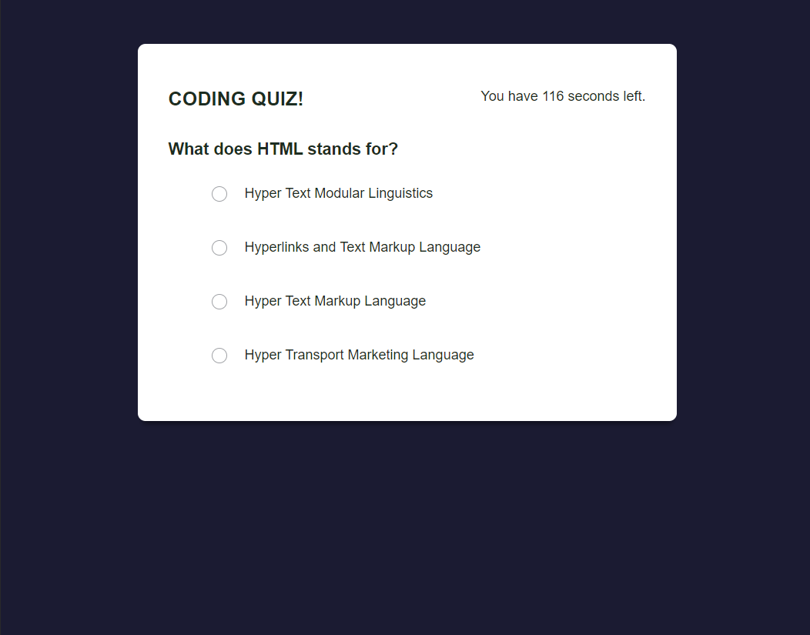
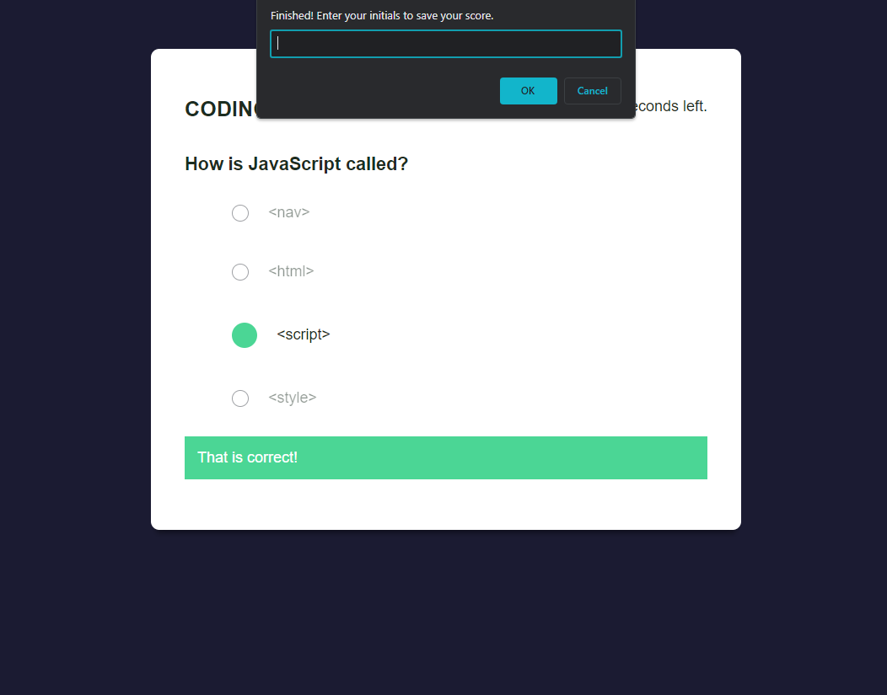

# Coding Quiz

## Description

This Coding Quiz is a web-based application that tests your knowledge of coding and programming concepts. It consists of a series of multiple-choice questions, and your goal is to answer as many questions as you can within a limited amount of time.

## Usage

1. Start the Quiz:
   - Click the "Start Quiz" button to begin the quiz.

2. Timer:
   - When you start the quiz, a timer will begin counting down from a set amount of time (120 seconds).
   
3. Answering Questions:
   - You will be presented with a series of questions, one at a time.
   - Select one of the provided answer choices for each question by clicking on it.

4. Incorrect Answers:
   - If you answer a question incorrectly, time will be subtracted from the timer (10 seconds).
   
5. Game Over:
   - The game ends when one of the following conditions is met:
     - You have answered all the questions.
     - The timer reaches 0.

6. Saving Your Score:
   - After the game is over, you will have the opportunity to save your initials and score.
     - Click the "Save" button to save your score.
     - Your initials and score will be stored in local storage.
     
7. Restart the Quiz:
   - If you wish to play again, you can click the "Restart Quiz" button to reset the game and start over.

## Technologies Used

- HTML
- CSS
- JavaScript
- Local Storage

## Assets
The following image demonstrates the web application's appearance and functionality:

## Link to GitHub Repository:

[https://github.com/ademonteverde/coding_quiz](https://github.com/ademonteverde/coding_quiz)

## Link to deployed application:

[https://ademonteverde.github.io/coding_quiz/](https://ademonteverde.github.io/coding_quiz/)

## License

This project is licensed under the [MIT](https://github.com/ademonteverde/coding_quiz/blob/main/LICENSE) License.

